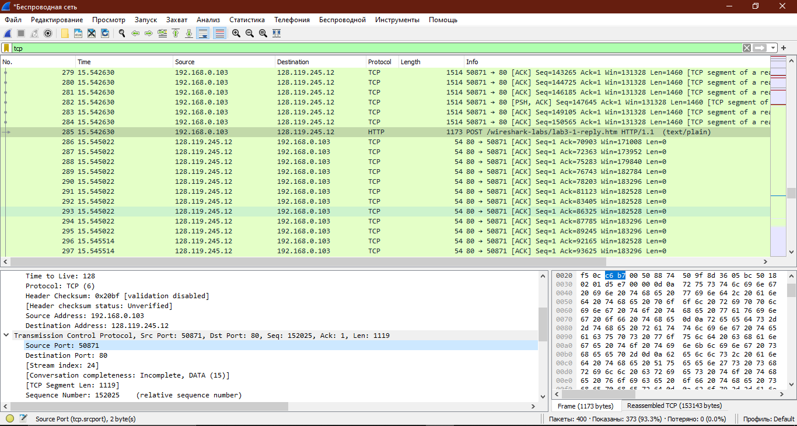

## Homework 7. ***Транспортный уровень***

## 1. Wireshark: TCP

### Вопросы

1. IP адрес отправителя (Source Address) - 192.168.0.103 и порт (Source Port) - 50871

2. IP адрес gaia.cs.umass.edu (Destination Address) - 128.119.245.12 c портом (Destination Port) - 80. Для отправки порт - 50871.

    

### Основы TCP

3. Порядковый номер SYN сегмента - 0. То что это SYN сегмент указывает флаг (установленный в 1).

    

4. Порядковый номер SYN - 0, порядковый номер ACK - 1. Сервер определил это значение прибавив 1 к порядковому номеру запрашиваемого SYN-сегмента. В SYNACK-сегменте флаги SYN и ACK установлены в 1.

    

5. Sequence Number: 152025 (relative sequence number)

    

6. Порядковые номера у первых 6 сегментов: 137, 138, 139, 140, 141, 142. Сам HTTP запрос имеет номер 285. Каждый сегмент был отправлен до HTTP запроса, почти сразу после SYN-ACK запроса. ACK-пакеты приходили после того, как сегмент был доставлен и привязан к нему [This is an ACK to the segment in frame: 149].

    

    Время отправки каждого сегмента и получения ACK:

    |     | SENT      | ACK       | RTT      |
    | :-: | :-------: | :-------: | :------: |
    | 137 | 15.131355 | 15.257033 | 0.125678 |
    | 138 | 15.131840 | 15.257033 | 0.125193 |
    | 139 | 15.131840 | 15.259862 | 0.128022 |
    | 140 | 15.131840 | 15.259862 | 0.128022 |
    | 141 | 15.131840 | 15.259862 | 0.128022 |
    | 142 | 15.131840 | 15.259862 | 0.128022 |

    Как видно из таблицы - разность времени отправки и получения подтверждения и есть значение RTT.

7. Пропускная способность = длина пакета / RTT.

    Допустим, для 137 сегмента:

    $$\ Пропускная \ способность = 876 / 0.125678 = 6970.2 \ байт/сек. $$

    Для всей передачи файла скорее всего нужно вычислить среднее значение по пропускной способности каждого сегмента.

## 2. Wireshark: Работа с Time-Sequence-Graph (Stevens)

