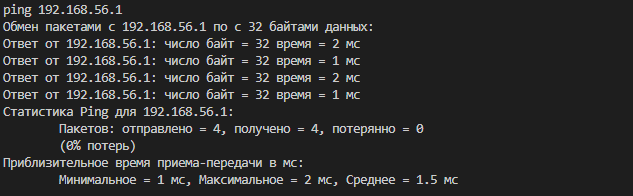

# Практика 10. Сетевой уровень

## Программирование.

Запуск программы:

```python icmp.py```

Когда программа запустится, появится строка "ping ", и нужно будет ввести нужный адрес.

Для наглядности, программа должна выглядить так:


