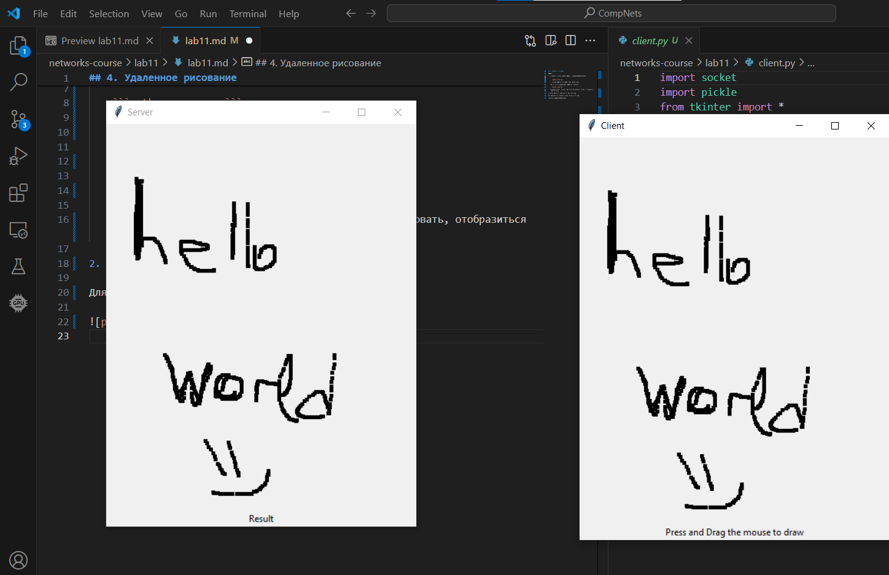

# Практика 11. Сетевой уровень

## 4. Удаленное рисование

Запуск:

1.     
    ```python server.py```
    
    Программа запустится и будет ждать подключения.

    Из второго терминала нужно запустить клиента:

    ```python client.py```

    В клиенте можно рисовать. Как только Вы начнёте рисовать, отобразиться окно сервера.

2. Чтобы закончить сеанс просто закройте окна.

Для наглядности, выглядить должно примерно вот так:


